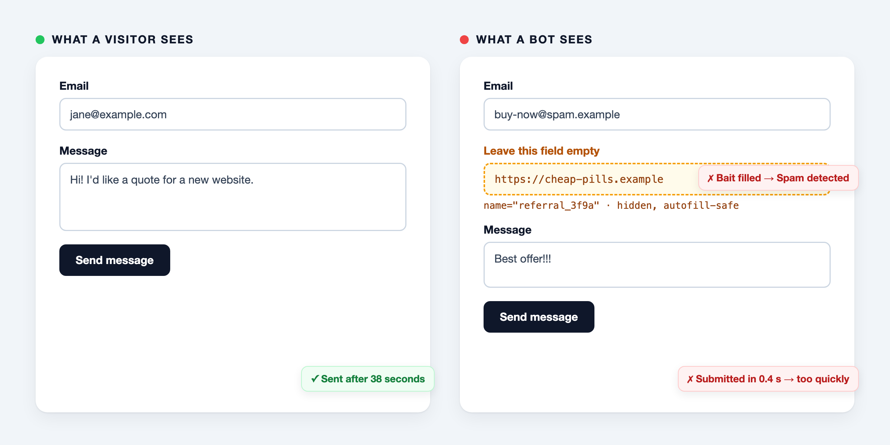

# Livewire Honeypot

Spam protection for **Livewire** and plain **Laravel** forms without a CAPTCHA. A hidden field that bots fill in, and a minimum time between loading and submitting the form. Invisible to visitors, no cookies, no third-party service.



```bash
composer require darvis/livewire-honeypot
```

Requires PHP 8.2+, Laravel 11, 12 or 13, and Livewire 3 or 4. No setup is needed.

## Livewire

```php
use Darvis\LivewireHoneypot\Traits\HasHoneypot;

class ContactForm extends Component
{
    use HasHoneypot;

    public string $email = '';

    public function submit(): void
    {
        $this->validate(['email' => 'required|email']);
        $this->validateHoneypot();

        // process the form ...

        $this->reset('email');
        $this->resetHoneypot();
    }
}
```

```blade
<form wire:submit="submit">
    <input type="email" wire:model="email">
    <x-honeypot />
    <button type="submit">Send</button>
</form>
```

## Controller

```blade
<form method="POST" action="/contact">
    @csrf
    <input type="email" name="email">
    <x-honeypot />
    <button type="submit">Send</button>
</form>
```

```php
use Darvis\LivewireHoneypot\Services\HoneypotService;

public function store(Request $request, HoneypotService $honeypot)
{
    $honeypot->validate($request->all());

    // process the form ...
}
```

## What you get

- A bait field with a generated name that browser autofill and password managers leave alone
- A start time that can't be faked: locked properties in Livewire, a signed token in plain forms
- One `<x-honeypot />` component for both, which also shows the error message
- A `SpamBlocked` event to log blocked attempts
- English and Dutch translations, and a Laravel Boost guideline and skill

Read [how it works](how-it-works.md) to see what a honeypot stops, and what it doesn't, or see how it [compares to spatie/laravel-honeypot and Turnstile](comparison.md).
